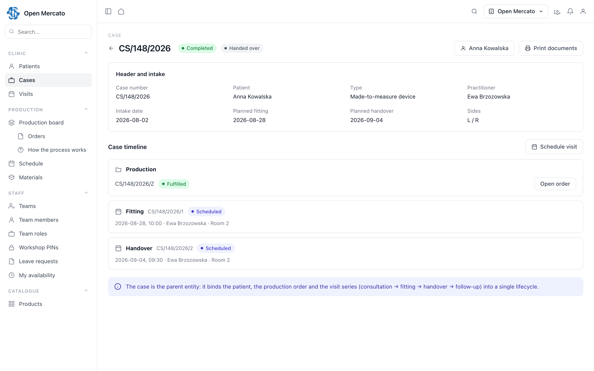
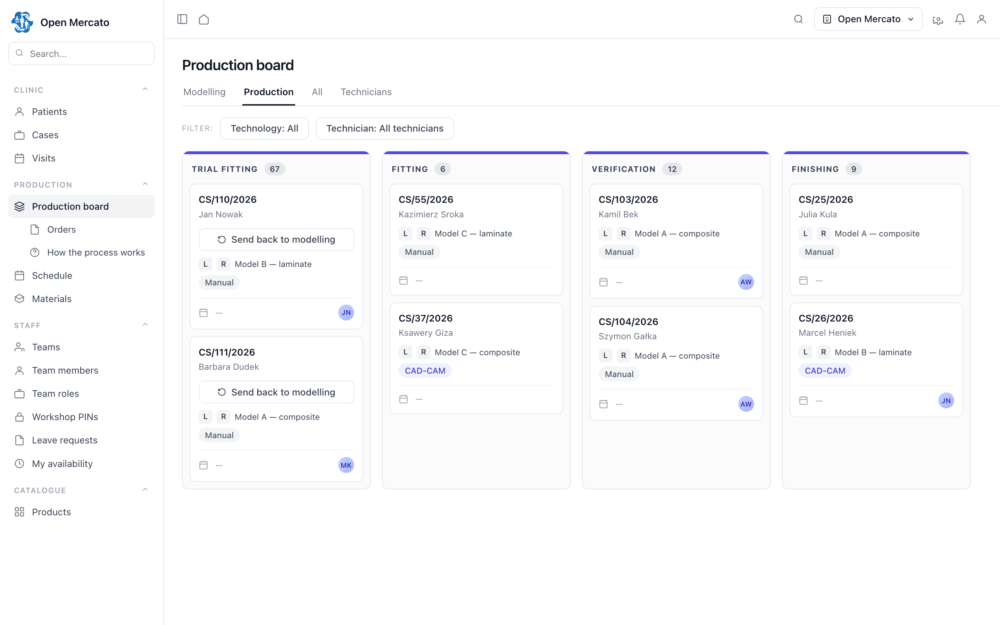

# SPEC-005: Patient Cases — Made-to-Order Production for a Person

## TLDR

**Key Points:**
- New community module `@open-mercato/patient-cases` (module ID `patient_cases`) introducing the **case** — one lifecycle binding a person, a series of appointments, and a production order.
- Unlocks made-to-order manufacturing where the subject of the order is a person under GDPR Art. 9: orthotics, prosthetics, dental labs, hearing aids, custom insoles and orthopaedic footwear, bespoke eyewear.

**Scope:**
- `Patient` — record with encrypted PII, hash-based deduplication on a national identifier, fallback identity path.
- `Case` — lifecycle from intake to handover, carrying measurements, product specification, and references to the production and sales orders.
- `Visit` — an appointment within a case, typed from a per-tenant dictionary, with an explicit state machine, buffers, and multi-participant conflict checking on top of `planner`, `staff` and `resources`.
- Consent is **not** implemented here — it is consumed from `@open-mercato/forms` (`FormConsentRecord`).

**Concerns:**
- Core has no appointment primitive at all. Q1 decides whether the appointment layer belongs in this module or in a generic scheduling module — the answer moves three entities and three API routes.
- Declaring patient names in `defaultEncryptionMaps` breaks fuzzy search, which reception depends on daily. Q3 asks whether the platform has a direction for this.

## Open Questions

> This is a **design-only PR**. No package is scaffolded and no code is contributed until these are answered, because Q1 and Q2 change which entities this module owns.

- **Q1**: Should the appointment layer (`Visit`, `VisitType`, `VisitParticipant`, `TimeBlock`) live in this module, in a **generic subject-agnostic scheduling module**, or as a contribution extending `planner` with a booking layer? The layer is broader than this vertical — beauty, field service, consulting and training need the same primitive — and the OpenEMR/OpenMRS split between practice management and the record layer suggests the generic option.
- **Q2**: Consent reuse. This spec assumes `patient_cases` consumes `@open-mercato/forms` `FormConsentRecord` with `subject_type = 'patient_cases.patient'` rather than shipping its own consent log. Is that the intended composition, and is `forms` an acceptable peer dependency for a community module?
- **Q3**: Search over encrypted fields. Once `first_name` / `last_name` are declared in `defaultEncryptionMaps`, fuzzy search stops working, and reception searches by surname constantly. Do `query_index` / `search` have a planned direction for encryption-mapped fields? Without one, v1 does exact-match lookup via `hashField` only, with the limitation stated rather than failing silently.
- **Q4**: Role-scoped field visibility. The requirement is that a workshop role sees a patient's first name, last name, height and weight and nothing else, enforced server-side. Is that a platform concern (RBAC/UMES) or a module concern? If platform, it ships as a separate contribution and this module only configures it.
- **Q5**: Clinical documentation is assumed out of scope — a case carries measurements, specification, schedule and status, not diagnoses (in Poland this additionally touches the EDM/P1 regulatory surface). Confirming this closes the `Case` entity.

---

## Overview

`patient_cases` serves organisations that manufacture a made-to-order product **for a specific person**, where the product is derived from that person's measurements and delivered through a sequence of appointments running in parallel with a workshop process.

The target audience is small-to-mid manufacturers in regulated care-adjacent verticals: orthotics and prosthetics, dental laboratories, hearing-aid providers, custom insole and orthopaedic footwear makers, bespoke eyewear. What they share is a shape core cannot express today: an order whose content is body measurements, whose subject is a person under GDPR Art. 9, and whose fulfilment is a visit series (consultation → fitting → trial fitting → finishing → handover → follow-up).

Key benefits: a single case lifecycle instead of a patient record and a calendar stitched together per deployment; encryption, deduplication and retention handled once by the platform instead of re-implemented per integrator; and a production board that can be shown to the workshop floor without exposing patient data.

> **Market Reference**: Studied HL7 FHIR (`Patient` / `Schedule` / `Slot` / `Appointment` / `Encounter`), OpenMRS, OpenEMR and Cal.com.
> **Adopted**: the separation of *planned* from *actual* (FHIR keeps `Appointment` apart from `Encounter`) — modelled here as an explicit state machine rather than two entities; the three-way distinction between free, booked and **blocked** time; booking as a multi-actor reservation, since FHIR hangs a schedule off an actor (practitioner, location, device) and a conflict check must therefore cover all of them; booking type as configurable data with its own duration and buffers, as in Cal.com's event types; a nullable national identifier, since no mature system treats one as mandatory; and non-attendance as its own terminal state rather than a cancellation.
> **Rejected**: slot materialisation — FHIR pre-generates `Slot` rows while Cal.com computes availability on the fly; the computed approach avoids a table to maintain, backfill and desynchronise, and the platform cache covers the performance gap at this scale. Also rejected: FHIR conformance as such (this module is FHIR-*shaped*, not FHIR-*conformant* — full resources and terminology bindings are cost without a consumer until data exchange is actually required), the participant confirmation round-trip (`AppointmentResponse` — in a practice the receptionist sets the time), and recurring visits or treatment series.

## Problem Statement

**Core cannot express an appointment.** Verified against the generated module fact-sheets for core 0.6.6: zero matches for `appointment`, `booking`, `visit` or `slot` across entities, events and API routes. What exists nearby stops short:

| Module | What it owns | What it does not own |
|---|---|---|
| `planner` | `planner_availability_rule_set`, `planner_availability_rule`, `plannerAvailabilityService` | anything booked against that availability |
| `resources` | `resources_resource`, `resources_resource_type` — "assets and resources with scheduling policies" | the schedule itself |
| `staff` | `staff_team_member`, `staff_leave_request`, time entries | who that member is seeing, and when |
| `customers` | 26 CRM entities including `customer_activity`, `customer_interaction` | a person under GDPR Art. 9, and a booked appointment |
| `sales` | orders, fulfilment, billing | an order whose content is body measurements and whose recipient owns them |

The planning primitives exist and are good. What is missing is the entity that consumes them, and the subject the whole cycle organises itself around.

**Evidence from a live deployment.** A manufacturer of made-to-measure devices for patients (client anonymised) migrated from a low-code platform to Open Mercato. OM is the system of record there — patient records, measurement charts, a production board, and a workshop tablet with PIN login. Three defects logged during the internal test run before launch map directly onto the gaps above:

1. **The visit calendar** had to be built from scratch, including all conflict and availability handling, because core has no appointment concept.
2. **Terminology drift between "consultation" and "visit"** — not a typo but a symptom. With nothing modelling the difference between a *case* and a *visit within it*, the vocabulary split apart in the code and in conversations with the client. A consultation is in fact one visit type within a case, not a synonym for the case.
3. **Search collided with encryption** — a direct consequence of encrypting PII at rest without a lookup strategy designed alongside it. Any integrator who declares personal fields in encryption maps according to platform rules hits the same wall.

A fourth observation concerns access rather than a defect: the owner refused workshop technicians access to sensitive patient data, granting them exactly first name, last name, weight and height. The production board and the tablet went live under that constraint — a field-level requirement on a record that is simultaneously the subject of a production order (Q4).

## Proposed Solution

A community module owning three concepts and duplicating nothing core or another community module already provides.

**`Patient`** — the record. PII declared in `defaultEncryptionMaps`; deduplication on `national_id_hash` with tenant-scoped uniqueness; a fallback identity path (identity document type and number) when no national identifier exists, since foreign patients and newborns are a normal population rather than an edge case.

**`Case`** — one lifecycle from intake to handover, binding the patient, the measurements, the product specification, the visit series, and references to the production and sales orders. Hierarchical numbering is user-visible: case `OL/148/2026`, production order `OL/148/2026/Z`, visits `/1`, `/2`.

**`Visit`** — an appointment within a case, typed from a per-tenant dictionary, with an explicit state machine covering non-attendance, per-type buffers, and conflict checking that considers every participant of the reservation.

**Consent is consumed, not rebuilt.** `@open-mercato/forms` already ships `FormConsentRecord` — a per-subject, per-clause, deliberately PII-free projection keyed by `(organization_id, subject_type, subject_id, form_id, consent_field_key)` with `active` / `superseded` / `revoked` status, materialised by the `forms-consent-projector` subscriber. This module uses it with `subject_type = 'patient_cases.patient'` instead of shipping a parallel consent log (Q2).

### Design Decisions

| Decision | Rationale |
|----------|-----------|
| The **case** is the central entity; patient and visits are its layers | Modelling the patient record and the appointment as two independent capabilities duplicates the numbering, the vocabulary and the lifecycle in two places — which is the same terminology debt described in the Problem Statement, relocated into the architecture |
| Consent consumed from `forms`, not owned here | `FormConsentRecord` is already subject-agnostic, PII-free and clause-hash-versioned; a second consent log would fragment the audit surface and duplicate GDPR export/erasure that `forms` already implements |
| Availability computed on the fly, not materialised | No slot table to maintain, backfill or desynchronise; the platform cache with tenant tags covers the read cost, and materialisation stays available as an exit path |
| One `Visit` entity with a state machine, not FHIR's `Appointment` + `Encounter` | While clinical documentation is out of scope (Q5) an encounter carries almost nothing beyond a status; splitting it out later is additive |
| `measurements` / `specification` as `jsonb` | Their shape depends on the product type and is defined per tenant; individual dimensions are never filtered or sorted on. Everything that *is* filtered on has its own column |
| `no_show` is a terminal state distinct from `cancelled` | They are different business events with different operational meaning; collapsing them makes the resulting metric meaningless |
| Every case status change writes a `CaseTransition` row | The status column is never edited without history, which is what makes the lifecycle auditable and reversible |

### Alternatives Considered

| Alternative | Why Rejected |
|-------------|-------------|
| Extend `customers` with a "patient" role | Drags an Art. 9 domain into a module built for sales and marketing semantics, and forces patient rows to be special-cased in RBAC and encryption inside a module never designed for it |
| Model the visit as a `customer_activity` | A CRM activity has no resource booking, no conflict check and no state machine. A booked appointment is a commitment in a calendar, not an entry in a contact history |
| Model the case as a `sales.order` with extra fields | A sales order has neither a visit series nor measurements as its content, and its recipient is a counterparty rather than the person whose measurements are the subject. The link to sales exists as a reference, not as inheritance |
| Ship an own `PatientConsent` append-only log | Duplicates `forms.FormConsentRecord`, which is already subject-agnostic and PII-free, and would fragment GDPR export/erasure across two modules |
| Separate modules for the patient record and for appointments | Both halves describe parts of something whose centre is the case; separating them duplicates numbering, vocabulary and lifecycle |
| A materialised slot table, FHIR-style | A table to maintain, backfill and desynchronise, bought for performance not yet needed at this scale |

## User Stories / Use Cases

- **A receptionist** wants to open a case for a returning patient without re-entering their details, so that intake takes seconds and no duplicate record is created.
- **A receptionist** wants to book the next appointment in the series directly from the case timeline, so that the fitting is scheduled while the patient is still at the desk.
- **A practitioner** wants measurements captured on a structured chart with left/right copy, so that the workshop receives unambiguous input rather than a scanned form.
- **A workshop technician** wants to see the case number, the product type and the patient's height and weight on the production board, and nothing else, so that the practice can grant floor access without exposing patient data.
- **A practice owner** wants non-attendance recorded distinctly from cancellation, so that the no-show rate is a real, reducible number rather than a guess.
- **A data protection officer** wants every consent event to be queryable per patient with the clause version that was signed, so that an audit can be answered without opening submissions.

## Architecture

The module owns nothing that core already provides. Availability rules come from `planner`, attending people from `staff`, rooms and equipment from `resources`, the sales link from `sales`, and consent from `forms`. Every one of those links is an indexed plain-`uuid` (or string) column — no ORM relation crosses a module boundary.

```
                 ┌────────────────────────────────────────────┐
                 │              patient_cases                 │
                 │                                            │
   Patient ──────┤  Case ──┬── Visit ──── VisitParticipant     │
   (encrypted)   │         │     │                            │
                 │         │     └── VisitType ── TimeBlock    │
                 │         └── CaseTransition                  │
                 └───┬────────┬────────┬────────┬──────────────┘
                     │        │        │        │
        forms ───────┘        │        │        └────── sales
   (consent record)           │        │            (order reference)
                         planner    staff / resources
                    (availability)  (participants, absence)
```

**Availability service.** One DI-registered service combines `planner` rule sets, existing visits, per-type buffers and time blocks into a free-slot list. It is the only read worth caching — tagged `tenant:<id>`, `org:<id>` and the entity type, invalidated by visit events after commit. The result is advisory: the write path re-checks and is authoritative.

**Write path.** All mutations go through the Command pattern. Multi-phase writes (case scalar changes plus a transition row, or a visit plus its participants) use `withAtomicFlush(em, phases, { transaction: true })`; side effects and cache invalidation run after commit, never inside the flush.

### Commands & Events

- **Commands**: `patient_cases.patient.create` · `patient_cases.patient.update` · `patient_cases.case.create` · `patient_cases.case.transition` · `patient_cases.visit.schedule` · `patient_cases.visit.reschedule` · `patient_cases.visit.transition`
- **Events**: `patient_cases.case.created` · `patient_cases.case.status_changed` · `patient_cases.case.handed_over` · `patient_cases.visit.scheduled` · `patient_cases.visit.rescheduled` · `patient_cases.visit.cancelled` · `patient_cases.visit.no_show`

Events make the operational metrics — no-show rate, schedule utilisation, time-to-handover — measurable without bolting on separate analytics.

### UMES Extension Points

The module is an external extension and modifies no core package.

| Extension point | Use |
|---|---|
| **Event subscribers** | `staff.leave_request.created` / `.updated` → materialise a `TimeBlock` with `source = 'staff_leave'`. `forms.submission.submitted` is *not* subscribed to — `forms` already projects consent itself; this module reads the projection |
| **Response enrichers** | Attach the practitioner's display name (from `staff`) and the room name (from `resources`) to case and visit list responses, instead of joining across modules |
| **Widget injection** | `InjectionDataTableWidget` adding an "Open case" row action to the `sales` order table when an order carries a `patient_cases` reference; `InjectionMenuItemWidget` on `menu:sidebar:main` for the module's pages |
| **API interceptors** | None in v1. Listed explicitly so the absence is a decision, not an omission |
| **Custom entities** | None — all entities are module-owned |

## Data Models

All entities carry the standard columns: `id` (UUID PK), `organization_id`, `tenant_id`, `created_at`, `updated_at`, `deleted_at`, `is_active`, with `organization_id` indexed. Only domain fields are listed below.

### Patient (`patient_cases_patients`)
- `first_name`: string — encrypted
- `last_name`: string — encrypted
- `phone`: string, nullable — encrypted
- `email`: string, nullable — encrypted; `email_hash`: string, nullable, indexed
- `national_id`: string, nullable — encrypted; `national_id_hash`: string, nullable, **unique per tenant**
- `has_no_national_id`: boolean, default `false`
- `identity_document_type`: string, nullable — `passport` | `other`
- `identity_document_number`: string, nullable — encrypted
- `birth_date`: date, nullable
- `sex`: string, nullable — `female` | `male` | `other` | `unknown`
- `preferred_language`: string(8), nullable — ISO 639-1
- `address_line`, `city`: string, nullable — encrypted
- `postal_code`: string(16), nullable
- `height_cm`, `weight_kg`: int, nullable
- `default_practitioner_id`: string, nullable, indexed — FK id → `staff.staff_team_member`

`national_id_hash` is nullable, so Postgres's `NULL <> NULL` semantics already permit any number of patients without an identifier under a unique index, with no extra schema work.

### Case (`patient_cases_cases`)
- `case_number`: string(64) — unique per organization
- `patient_id`: string, indexed — FK id → `patient_cases_patients`
- `product_type_id`: string, nullable — FK id → the tenant's product catalogue
- `status`: string — `draft` | `in_progress` | `in_production` | `ready` | `handed_over` | `cancelled`
- `sides`: string, nullable — `left` | `right` | `both`
- `measurements`: jsonb, nullable — shape defined per product type
- `specification`: jsonb, nullable
- `planned_fitting_at`, `planned_handover_at`: timestamptz, nullable
- `practitioner_id`: string, nullable, indexed — FK id → `staff`
- `production_order_ref`: string, nullable
- `sales_order_id`: string, nullable, indexed — FK id → `sales`

### CaseTransition (`patient_cases_case_transitions`)
- `case_id`: string, indexed
- `from_status`, `to_status`: string
- `changed_by`: string — `auth.user` id
- `note`: text, nullable

Append-only. A status is never written without a matching transition row.

### VisitType (`patient_cases_visit_types`)
- `code`: string(64) — unique per organization; e.g. `consultation`, `fitting`, `trial_fitting`, `finishing`, `handover`, `follow_up`
- `name`: string(255)
- `duration_minutes`: int
- `buffer_before_minutes`, `buffer_after_minutes`: int, default `0`
- `required_resource_type_id`: string, nullable — FK id → `resources.resources_resource_type`
- `availability_rule_set_id`: string, nullable — FK id → `planner.planner_availability_rule_set`

### Visit (`patient_cases_visits`)
- `case_id`: string, indexed
- `visit_type_id`: string, indexed
- `starts_at`, `ends_at`: timestamptz, indexed
- `status`: string — `scheduled` | `confirmed` | `checked_in` | `completed` | `cancelled` | `no_show`
- `sequence_no`: int — the `/1`, `/2` suffix within the case
- `cancelled_reason`: string, nullable

```
scheduled ──▶ confirmed ──▶ checked_in ──▶ completed
    │             │              │
    ├─────────────┴──────────────┴─▶ cancelled     (cancelled in advance)
    └─────────────────────────────▶ no_show        (did not attend — its own terminal state)
```

### VisitParticipant (`patient_cases_visit_participants`)
- `visit_id`: string, indexed
- `participant_type`: string — `practitioner` | `room` | `equipment`
- `participant_id`: string, indexed — FK id → `staff` or `resources`

One row per actor. The conflict check covers every row, not only the practitioner.

### TimeBlock (`patient_cases_time_blocks`)
- `participant_type`, `participant_id`: string, indexed
- `starts_at`, `ends_at`: timestamptz, indexed
- `reason`: string(255), nullable
- `source`: string — `manual` | `staff_leave`

Blocked time is distinct from booked time; both remove availability, only one is a reservation.

### Encryption

`src/modules/patient_cases/encryption.ts` declares `defaultEncryptionMaps` for `patient_cases:patient` covering `first_name`, `last_name`, `phone`, `address_line`, `city`, `identity_document_number`, `email` (`hashField: 'email_hash'`) and `national_id` (`hashField: 'national_id_hash'`). Reads go exclusively through `findWithDecryption` / `findOneWithDecryption` with `{ tenantId, organizationId }`.

Deliberately not encrypted: `sex`, `preferred_language`, `postal_code`, `height_cm`, `weight_kg` — classification codes and numbers that must be filtered and grouped on, with no compliance benefit from encryption. **Case, visit and time-block entities hold no personal data at all**; they reference the patient by id, which is what makes it possible to show the production board and the calendar to a role with no right to the patient record.

### Consent (external)

Consent state is read from `forms.FormConsentRecord` with `subject_type = 'patient_cases.patient'` and `subject_id = patient.id`. The module stores no consent columns. Opening a case requires an `active` record for the tenant-configured terms clause; processing and marketing consents are read for display and for governing consent-dependent processing, and do **not** gate the record — the lawful basis for holding the documentation is a statutory retention obligation, not a consent the patient could withdraw out from under the practice.

## API Contracts

All list/CRUD routes use `makeCrudRoute` with `indexer: { entityType }`. Every route file exports per-method `metadata` (`requireAuth`, `requireFeatures`) and `openApi`.

### Patients
- `GET | POST | PUT | DELETE /api/patient-cases/patients` — features `patient_cases.view` / `.create` / `.edit` / `.delete`
- Request (POST): `{ firstName, lastName, phone?, email?, hasNoNationalId, nationalId?, identityDocumentType?, identityDocumentNumber?, birthDate?, sex?, preferredLanguage?, addressLine?, city?, postalCode?, heightCm?, weightKg?, defaultPractitionerId? }`
- Response: `{ item: Patient }` with encrypted fields decrypted for roles holding `patient_cases.view_sensitive`, and reduced to the visible subset otherwise (Q4)
- Errors: `409 { error: 'duplicate_national_id', patientId }` · `400 { error: 'identity_inconsistent' }`

### Patient lookup
- `GET /api/patient-cases/patients/lookup?nationalId=` — feature `patient_cases.view`
- Response: `{ match: { id, displayName } | null }` — always `200`. Advisory before submit; the unique index is the authoritative block.

### Cases
- `GET | POST | PUT | DELETE /api/patient-cases/cases` — features `patient_cases.view` / `.create` / `.edit` / `.delete`
- Request (POST): `{ patientId, productTypeId?, sides?, plannedFittingAt?, plannedHandoverAt?, practitionerId? }`
- Errors: `422 { error: 'terms_consent_missing' }` when no `active` terms consent record exists for the patient

### Case transition
- `POST /api/patient-cases/cases/:id/transition` — feature `patient_cases.edit`
- Request: `{ toStatus, note? }` · Response: `{ item: Case, transition: CaseTransition }`
- Errors: `409 { error: 'illegal_transition', from, to }`

### Visit types
- `GET | POST | PUT | DELETE /api/patient-cases/visit-types` — features `patient_cases.view` / `.create` / `.edit` / `.delete`

### Visits
- `GET | POST | PUT | DELETE /api/patient-cases/visits` — features `patient_cases.view` / `.create` / `.edit` / `.delete`
- Request (POST): `{ caseId, visitTypeId, startsAt, participants: [{ participantType, participantId }] }`
- Errors: `409 { error: 'participant_conflict', conflicts: [{ participantType, participantId, visitId }] }`

### Visit transition
- `POST /api/patient-cases/visits/:id/transition` — feature `patient_cases.edit`
- Request: `{ toStatus, cancelledReason? }` · Errors: `409 { error: 'illegal_transition', from, to }`

### Availability
- `GET /api/patient-cases/visits/availability?visitTypeId=&practitionerId=&from=&to=` — feature `patient_cases.view`
- Response: `{ slots: [{ startsAt, endsAt }] }` — computed from `planner` rules minus visits, buffers and time blocks. Advisory; the write decides.

## Internationalization (i18n)

Keys under `patient_cases.*`, with `en` as the source locale and `pl` shipped alongside (the reference deployment is Polish).

- `patient_cases.page.title`, `patient_cases.page.group`
- `patient_cases.patient.*` — field labels, identity-block copy, masking hint
- `patient_cases.case.*` — status labels, timeline headings
- `patient_cases.visit.*` — visit-type names for the seeded dictionary, status labels
- `patient_cases.consent.*` — copy explaining that processing consent governs optional processing and does not gate the record
- `patient_cases.error.*` — `duplicate_national_id`, `identity_inconsistent`, `terms_consent_missing`, `participant_conflict`, `illegal_transition`

No hardcoded user-facing strings; all copy resolves through `useT()`.

## UI/UX

Backend pages under `/backend/patient-cases`, all sharing one `pageGroup` / `pageGroupKey`. Only the non-obvious parts are described; standard `CrudForm` / `DataTable` patterns are not re-documented.

**Case timeline** — the module's central screen. `FormHeader mode="detail"` with the case status, then the production order and the visit series as items of a single lifecycle under hierarchical numbering. Booking the next visit is an action on the case, not a separate flow.

**Patient record** — the identity block carries a "patient has no national identifier" toggle that swaps the identifier field for a fallback document type and number. The identifier field runs a debounced `lookup` with a blocking `Alert` on a match. The consent block renders `forms` consent records read-only, with a link to the signing flow; withdrawal is exactly as much a single click as granting, because asymmetry there is a legal defect rather than a UX one.

**Visit calendar** — filtered by visit type from the dictionary. Blocked time is visually distinct from booked time; they are not the same thing. State changes in one click, with "did not attend" as prominent as "cancelled" — otherwise reception uses cancellation for both and the metric stops meaning anything.

**Measurement chart** — a stepped wizard with autosave, left/right side switching and copy-between-sides. Measurements are the content of the case, not an attachment.

**Production board** — a `DataTable`-backed board whose stages are per-tenant configurable data. This is the screen the workshop floor sees, and the one that must not display sensitive data (Q4).

`DataTable` hosts keep `entityId` and `extensionTableId` stable (`patient_cases.patient`, `patient_cases.case`, `patient_cases.visit`) so injection from other modules stays backward-compatible. `pageSize` ≤ 100. Every dialog supports `Cmd/Ctrl+Enter` to submit and `Escape` to cancel; icon-only buttons carry `aria-label`.

### Illustrative mocks

The three screens below are static mocks of the proposed module, rendered with synthetic data and a deliberately generic made-to-measure product. They illustrate the design described above; they are not screenshots of any customer's system.

**Case timeline** — the case as the parent entity, binding the patient, the production order and the visit series into one lifecycle.



**Visit calendar** — visit types are per-tenant configuration, not a hardcoded enum. Nothing on this screen is domain-specific, which is the substance of Q1.


**Production board** — workshop stages run in parallel with the visit series and feed back into it: sending an item back to modelling moves the planned handover, which moves the appointment.



## Configuration

- Terms clause binding — tenant setting naming the `forms` form id and `consent_field_key` that count as the practice's terms acceptance. Without it the terms gate is inactive and case creation is not blocked.
- Case-number format — tenant setting; defaults to `{PREFIX}/{SEQ}/{YYYY}`.

## Migration & Compatibility

- **Additive only.** The module introduces new tables and changes no existing contract or schema. Disabling it touches nothing.
- Migrations are generated with `yarn mercato db:generate` from entity changes; none are hand-written.
- No backfill is required for a new installation. For a tenant migrating from a bespoke implementation, patient import must run before the encryption maps are seeded, or `yarn mercato entities seed-encryption` must be re-run afterwards.
- **Peer dependency**: `@open-mercato/forms` for consent. If absent, the terms gate is inactive and the consent block renders an empty state; nothing else degrades. This is the only cross-package dependency.
- **Optional peers**: `planner`, `resources`, `staff`, `sales`. Each absence degrades one capability and none breaks the schema (see the Risk Register).

## Implementation Plan

### Phase 1: Patient record
1. Scaffold `packages/patient-cases` with the `scaffold-module` skill; `src/modules/patient_cases/` with `index.ts`, `acl.ts`, `setup.ts`.
2. `data/entities.ts` — `Patient`; `data/validators.ts` — identifier normalisation and the `has_no_national_id` ↔ fallback-document branching.
3. `encryption.ts` with the PII map and hash fields; generate the migration.
4. `api/patients/route.ts` via `makeCrudRoute` with `indexer`; `api/patients/lookup/route.ts`.
5. Backend list + record pages with identifier masking and the debounced lookup alert.

### Phase 2: Case
1. `Case` and `CaseTransition` entities; generate the migration.
2. Case create/update commands; `api/cases/route.ts`.
3. `api/cases/[id]/transition/route.ts` with the state machine and `patient_cases.case.status_changed`.
4. Measurements and specification editing with autosave and left/right copy.
5. Case timeline page.
6. `forms` consent integration — terms gate on case creation, consent block on the record page.

### Phase 3: Visits *(gated on Q1)*
1. `VisitType` entity and CRUD; seed the default dictionary in `setup.ts`.
2. `Visit` and `VisitParticipant` entities; visit commands and the state machine.
3. Multi-participant conflict checking including buffers.
4. `TimeBlock` entity and the `staff.leave_request.*` subscriber.
5. Availability service with cache tagging and event-driven invalidation.
6. Visit calendar page with one-click state changes.

### File Manifest

| File | Action | Purpose |
|------|--------|---------|
| `packages/patient-cases/package.json` | Create | `@open-mercato/patient-cases`, publishable |
| `packages/patient-cases/src/index.ts` | Create | Barrel exporting module metadata |
| `.../modules/patient_cases/index.ts` | Create | `ModuleInfo` metadata |
| `.../modules/patient_cases/acl.ts` | Create | `view`, `create`, `edit`, `delete`, `view_sensitive` |
| `.../modules/patient_cases/setup.ts` | Create | `defaultRoleFeatures`, seeded visit-type dictionary |
| `.../modules/patient_cases/encryption.ts` | Create | `defaultEncryptionMaps` |
| `.../modules/patient_cases/events.ts` | Create | `createModuleEvents` declarations |
| `.../modules/patient_cases/data/entities.ts` | Create | 7 entities |
| `.../modules/patient_cases/data/validators.ts` | Create | Zod schemas; types via `z.infer` |
| `.../modules/patient_cases/data/enrichers.ts` | Create | Practitioner and room display names |
| `.../modules/patient_cases/api/**/route.ts` | Create | 7 route files |
| `.../modules/patient_cases/subscribers/on-staff-leave.ts` | Create | Materialise `TimeBlock` |
| `.../modules/patient_cases/backend/**` | Create | List, record, timeline, calendar, board |
| `.../modules/patient_cases/widgets/injection-table.ts` | Create | Sales row action, sidebar menu item |
| `.../modules/patient_cases/i18n/{en,pl}.json` | Create | Locale dictionaries |

### Testing Strategy

- **Unit**: identifier normalisation and fallback branching; the two state machines including every illegal transition; buffer arithmetic in the conflict checker; availability subtraction of visits, buffers and blocks.
- **Integration**: duplicate identifier returns 409 with the existing id; fallback-identity patients save without a uniqueness check; case creation without an active terms consent returns 422; a buffer-only overlap is rejected; concurrent booking of the same slot yields 409 rather than an overwrite; staff leave blocks a slot without cancelling booked visits; a user lacking `patient_cases.view_sensitive` receives the reduced field set.
- **Sandbox**: install the preview build into `apps/sandbox`, run migrations, walk the intake → case → visit → handover path.

### Integration Coverage

| Surface | Covered by |
|---|---|
| `GET/POST/PUT/DELETE /api/patient-cases/patients` | TC-PC-001 (CRUD + dedup 409) |
| `GET /api/patient-cases/patients/lookup` | TC-PC-002 (match / no match / failure fail-open) |
| `GET/POST/PUT/DELETE /api/patient-cases/cases` | TC-PC-003 (CRUD + terms gate 422) |
| `POST /api/patient-cases/cases/:id/transition` | TC-PC-004 (legal + illegal transitions) |
| `GET/POST/PUT/DELETE /api/patient-cases/visit-types` | TC-PC-005 |
| `GET/POST/PUT/DELETE /api/patient-cases/visits` | TC-PC-006 (conflict, buffer, concurrency) |
| `POST /api/patient-cases/visits/:id/transition` | TC-PC-007 (`no_show` vs `cancelled` events) |
| `GET /api/patient-cases/visits/availability` | TC-PC-008 (blocks, buffers, `planner` absent) |
| UI: patient record, case timeline, visit calendar | TC-PC-009 (happy path walk-through) |

## Risks & Impact Review

### Data Integrity Failures

#### Concurrent creation of the same patient
- **Scenario**: Two receptionists submit the same national identifier within the same second; both lookups return no match before either write lands.
- **Severity**: Medium
- **Affected area**: `POST /api/patient-cases/patients`, patient record UI
- **Mitigation**: The tenant-scoped unique index on `national_id_hash` is the authoritative arbiter, not the advisory lookup. The second insert fails on the constraint and is translated into `409 { error: 'duplicate_national_id', patientId }` pointing at the existing record.
- **Residual risk**: Patients registered through the fallback-identity path have no system-level uniqueness at all. Accepted and documented; soft deduplication on the document number is deferred.

#### Case status written without a transition row
- **Scenario**: A crash between the scalar status update and the insert of `CaseTransition` leaves a case whose history does not explain its state.
- **Severity**: High
- **Affected area**: case lifecycle, audit trail
- **Mitigation**: Both writes run inside one `withAtomicFlush(em, phases, { transaction: true })`. Side effects and cache invalidation are outside the flush and fire only after commit.
- **Residual risk**: A direct database edit bypassing the module still desynchronises history — the same exposure every audited entity in the platform carries.

#### Visit created without its participants
- **Scenario**: The visit row commits but the `VisitParticipant` inserts fail, producing a booking that occupies nobody and is therefore invisible to the conflict checker.
- **Severity**: High
- **Affected area**: conflict checking, calendar correctness
- **Mitigation**: Visit and participants are written in a single transaction; the conflict check runs inside it, before commit.
- **Residual risk**: None material.

#### Referenced entity deleted mid-flight
- **Scenario**: A practitioner is removed from `staff`, or a room from `resources`, while visits referencing them exist.
- **Severity**: Medium
- **Affected area**: visit list, availability, enrichers
- **Mitigation**: Cross-module links are plain id columns with no FK constraint, so nothing cascades. Enrichers resolve a missing id to `null` and the UI renders an "unassigned" state.
- **Residual risk**: Historical visits keep an unresolvable id. Acceptable — it preserves the audit record rather than rewriting history.

### Cascading Failures & Side Effects

#### A subscriber fails while materialising a time block
- **Scenario**: The `staff.leave_request.*` subscriber throws, so an approved absence never becomes a `TimeBlock` and the slot stays bookable.
- **Severity**: Medium
- **Affected area**: availability, visit booking
- **Mitigation**: The subscriber is persistent and retried; failure never blocks the originating `staff` operation. Availability degrades toward *over*-offering slots rather than losing bookings.
- **Residual risk**: A window in which a receptionist can book into an absence. The collision surfaces on the case list rather than silently cancelling the visit.

#### `forms` unavailable or not installed
- **Scenario**: The consent projection cannot be read, so the terms gate has nothing to evaluate.
- **Severity**: Medium
- **Affected area**: case creation, consent block
- **Mitigation**: The gate is fail-open by design and documented as such: with no consent source the module does not block clinical operations, and the consent block renders an empty state. The alternative — blocking intake because an optional peer is down — is worse for the practice and no better for compliance, since the record's lawful basis is a retention obligation rather than consent.
- **Residual risk**: A tenant could run without consent capture and not notice. Mitigated by a setup-time warning when the terms clause setting is present but `forms` is absent.

#### Event storm on bulk rescheduling
- **Scenario**: Rescheduling a full day emits hundreds of visit events, each invalidating the availability cache.
- **Severity**: Low
- **Affected area**: cache, subscribers
- **Mitigation**: Invalidation is tag-based rather than per-key, so N events collapse into one tag bump.
- **Residual risk**: None material at practice scale.

### Tenant & Data Isolation Risks

#### Cross-tenant leak through availability
- **Scenario**: The availability service joins `planner` rules, visits and blocks; a missing scope filter in any one of them could surface another tenant's occupancy.
- **Severity**: Critical
- **Affected area**: availability endpoint, calendar
- **Mitigation**: Every query is scoped by `organization_id` and `tenant_id`, the service takes the scope as a required argument rather than reading ambient state, and integration tests assert a two-tenant fixture returns disjoint slots.
- **Residual risk**: None if the tests hold; this is the module's highest-severity failure mode and is treated as such.

#### Cache key collision across tenants
- **Scenario**: A cached availability window computed for one tenant is served to another.
- **Severity**: Critical
- **Affected area**: availability endpoint
- **Mitigation**: Cache keys include tenant and organization ids, and entries carry `tenant:<id>` / `org:<id>` tags.
- **Residual risk**: None.

#### Encrypted fields returned to an under-privileged role
- **Scenario**: A workshop role calls the patient endpoint directly and receives the full decrypted record because the visibility filter lives only in the UI.
- **Severity**: High
- **Affected area**: `GET /api/patient-cases/patients`, production board
- **Mitigation**: Field reduction happens in the read path, keyed on `patient_cases.view_sensitive`; the UI renders whatever the server returns. Q4 asks whether the mechanism belongs to the platform.
- **Residual risk**: Until Q4 is resolved the reduction is module-local, so a future platform mechanism will supersede it. Being additive, that migration is non-breaking.

### Migration & Deployment Risks

#### Encryption maps seeded after patient import
- **Scenario**: A tenant imports patients before `defaultEncryptionMaps` is applied, leaving plaintext rows that later reads treat as ciphertext.
- **Severity**: High
- **Affected area**: patient record, lookup
- **Mitigation**: Documented ordering — seed encryption before import — plus `yarn mercato entities rotate-encryption-key` to encrypt plaintext rows after the fact.
- **Residual risk**: A tenant that ignores both leaves PII at rest in plaintext. Detectable, correctable, and called out in the module README.

#### Migration interrupted midway
- **Scenario**: The migration adding seven tables fails partway.
- **Severity**: Low
- **Affected area**: installation
- **Mitigation**: Purely additive DDL, re-runnable, and no existing table is altered.
- **Residual risk**: None.

### Operational Risks

#### No-show rate silently wrong
- **Scenario**: Reception cancels no-shows instead of marking them, so the metric the practice relies on is systematically understated.
- **Severity**: Medium
- **Affected area**: reporting built on `patient_cases.visit.no_show`
- **Mitigation**: A product decision rather than a technical one — both actions are equally reachable from the calendar, and the two emit different events.
- **Residual risk**: Training-dependent. Worth a follow-up dashboard comparing cancellation timing distributions.

#### Availability recomputation cost at scale
- **Scenario**: A large practice with many practitioners and a long horizon makes on-the-fly computation slow.
- **Severity**: Medium
- **Affected area**: availability endpoint, calendar
- **Mitigation**: Tagged caching with event-driven invalidation; the query window is bounded by the requested range.
- **Residual risk**: Above some scale materialised slots become necessary. That path is deliberately left open and named here rather than discovered later.

#### Storage growth from transitions
- **Scenario**: `CaseTransition` grows without bound.
- **Severity**: Low
- **Affected area**: storage
- **Mitigation**: Rows are small and bounded by case count — single-digit rows per case.
- **Residual risk**: None material.

## Final Compliance Report — 2026-08-06

### AGENTS.md Files Reviewed
- `AGENTS.md` (root, official-modules)
- `.ai/specs/AGENTS.md`
- `.ai/skills/spec-writing/SKILL.md` and its `references/spec-template.md`, `references/spec-checklist.md`, `references/compliance-review.md`
- `packages/forms/AGENTS.md`

### Compliance Matrix

| Rule Source | Rule | Status | Notes |
|-------------|------|--------|-------|
| root AGENTS.md | Every module is an external extension; MUST NOT modify core packages | Compliant | New package only; core is consumed, never edited |
| root AGENTS.md | No cross-module `@ManyToOne` ORM relationships | Compliant | All cross-module links are plain id columns |
| root AGENTS.md | MUST filter every query by `organization_id` | Compliant | Scope is a required argument of the availability service; asserted by a two-tenant integration fixture |
| root AGENTS.md | Table names plural snake_case | Compliant | `patient_cases_patients`, `patient_cases_cases`, … |
| root AGENTS.md | Standard columns `id`, `organization_id`, `tenant_id`, `created_at`, `updated_at` | Compliant | Plus `deleted_at`, `is_active` |
| root AGENTS.md | Feature ID `<moduleId>.<action>` | Compliant | `patient_cases.view` / `.create` / `.edit` / `.delete` / `.view_sensitive` |
| root AGENTS.md | Event ID `<moduleId>.<entity>.<past_tense>` | Compliant | `patient_cases.visit.no_show`, `patient_cases.case.status_changed`, … |
| root AGENTS.md | MUST declare `defaultRoleFeatures` for every feature in `acl.ts` | Compliant | Declared in `setup.ts`; `view_sensitive` granted to admin and superadmin only |
| root AGENTS.md | API routes MUST export `openApi` and `metadata` | Compliant | Stated per route in API Contracts |
| root AGENTS.md | MUST use `makeCrudRoute` with `indexer: { entityType }` | Compliant | All list/CRUD routes |
| root AGENTS.md | Write operations MUST use the Command pattern | Compliant | Commands enumerated under Architecture |
| root AGENTS.md | MUST validate all inputs with zod in `data/validators.ts`; no `any` | Compliant | Types derived via `z.infer` |
| root AGENTS.md | MUST use `findWithDecryption` / `findOneWithDecryption` if PII exists | Compliant | Stated in Data Models → Encryption |
| root AGENTS.md | NEVER hand-write migrations | Compliant | Generated via `yarn mercato db:generate` |
| root AGENTS.md | No hardcoded user-facing strings | Compliant | i18n section enumerates key namespaces |
| root AGENTS.md | No raw `fetch`; use `apiCall`/`apiCallOrThrow` | Compliant | UI section |
| root AGENTS.md | `pageSize` ≤ 100; dialogs support `Cmd/Ctrl+Enter` and `Escape` | Compliant | UI section |
| root AGENTS.md | API route path `/api/<module>/<resource>` | Compliant | `/api/patient-cases/...` |
| root AGENTS.md | Package kebab-case, module ID snake_case | Compliant | `patient-cases` / `patient_cases` |
| `.ai/specs/AGENTS.md` | Spec includes TLDR, Overview, Problem Statement, Proposed Solution, Architecture, Data Models, API Contracts, Risks & Impact Review, Final Compliance Report, Changelog | Compliant | All present |
| `.ai/specs/AGENTS.md` | Risks document scenario, severity, affected area, mitigation, residual risk | Compliant | Risk Register format used throughout |
| spec-writing SKILL.md | Community modules MUST use UMES extension points | Compliant | Subscribers, enrichers and widget injection enumerated; the absence of interceptors is stated as a decision |
| spec-writing SKILL.md | Open Questions gate — stop before Research/Design until answered | **Partially compliant** | Research and a design sketch are included so maintainers can judge the collision question, but no package is scaffolded and no code is contributed. See Non-Compliant Items |

### Internal Consistency Check

| Check | Status | Notes |
|-------|--------|-------|
| Data models match API contracts | Pass | Every request field maps to a declared column; no endpoint references a field the model lacks |
| API contracts match UI/UX section | Pass | Lookup, transition and availability endpoints each back a described screen |
| Risks cover all write operations | Pass | Patient create, case create, case transition, visit create, visit transition and time-block materialisation each appear in the register |
| Commands defined for all mutations | Pass | Seven commands enumerated under Architecture |
| Cache strategy covers all read APIs | Pass | Availability is the only cached read; the rest are query-indexed CRUD |

### Non-Compliant Items

- **Rule**: "STOP after presenting the skeleton. Do not proceed to Research until all questions are answered. This is a hard gate."
- **Source**: `.ai/skills/spec-writing/SKILL.md`
- **Gap**: This spec carries Open Questions **and** completed Research, Design and an Implementation Plan, where the skill expects the gate to hold at the skeleton.
- **Recommendation**: Accepted deliberately, as an external contributor cannot resolve Q1–Q5 without maintainer input, and a bare skeleton would not give maintainers enough to judge the collision question. The gate is honoured where it matters: **no package is scaffolded and no code is contributed until Q1–Q5 are answered.** If maintainers prefer the strict reading, the design sections can be reduced to a skeleton and restored after the gate.

### Verdict

- **Non-compliant (by design)**: Blocked on Q1–Q5 by the module's own Open Questions gate. The specification is complete enough to review; implementation starts only after maintainer answers, and Phase 3 in particular is gated on Q1.

## Changelog

### [2026-08-09]
- Added three illustrative mocks under `assets/spec-005/` (case timeline, visit calendar, production board), rendered with synthetic data and a generic made-to-measure product.

### [2026-08-06]
- Initial specification.
- Dropped a previously planned module-owned `PatientConsent` entity after reviewing `packages/forms`: `FormConsentRecord` is already subject-agnostic, PII-free and clause-hash-versioned, so consent is consumed from `@open-mercato/forms` with `subject_type = 'patient_cases.patient'` rather than duplicated (raised as Q2).
- Market review against HL7 FHIR, OpenMRS, OpenEMR and Cal.com recorded under Overview.
