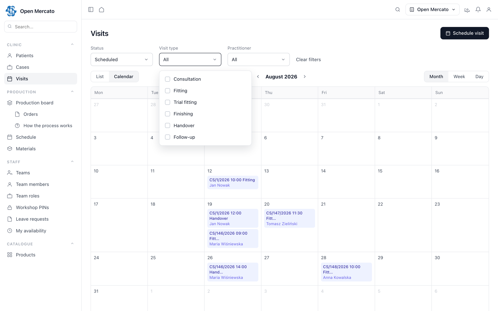

# SPEC-009: Appointment Layer — Practice Requirements for a Booking Engine

## TLDR

**Key Points:**
- Core owns availability (`planner`), the people and rooms that have it (`staff`, `resources`) and nothing that **books** against it. **SPEC-008 (PR #33) already proposes an engine for exactly that**, filed before this document.
- This document is therefore **not a competing proposal**. It states what an appointment-shaped consumer needs from such an engine — minute-level scheduling, per-type buffers, multi-participant reservations, server-side rejection, non-attendance as its own state, availability computed from `planner` — and gives a reference shape for each, so the requirements can be checked against a design rather than argued in the abstract.
- Two of the six are schema and write-path decisions, cheap while an engine is still a specification and expensive after an MVP ships. That is why they are published now rather than filed as feedback later.
- Split out of SPEC-005, which consumes whichever engine wins and depends on neither document.

**Scope:**
- `BookingType` — per-tenant dictionary entry with its own duration and buffers.
- `Booking` + `BookingParticipant` — the reservation and every actor it occupies.
- `TimeBlock` — time that is blocked without being booked, manual or projected from `staff` absence.
- The availability service — `planner` rules minus bookings, buffers and blocks, computed on the fly and cached.

**Concerns:**
- Two booking proposals in flight at once is worse for maintainers than either alone. This one yields the engine question to SPEC-008 and keeps only the requirements and the fallback.

## Open Questions

> **Design-only.** No package is scaffolded until Q1 is answered, because Q1 decides which package this is.

- **Q1**: Does **SPEC-008** (PR #33) take these six requirements into its scope? Its MVP is explicit that an hourly timeline is out of scope, that a conflict is a plain overlap, and that a booking ties **one** resource to a target — so items 1, 3 and 4 of the requirement list are open against it today, and items 3 and 4 change its schema and write path rather than its UI. If the answer is yes, this document becomes the acceptance criteria for that engine and its reference model below is redundant — the better outcome.
- **Q1b** (only if the answer to Q1 is no): where does a second layer belong — a subject-agnostic scheduling module, a `planner` contribution, or these entities inside `patient_cases` under the domain name `Visit*`? Under the last option every entity keeps its shape and gains the `patient_cases_` table prefix; nothing else changes.

No package is scaffolded under either answer until maintainers have picked one.

---

## Overview

`planner` answers "when is this person or room available"; nothing in the platform answers "and what is booked against that availability". Every vertical that schedules anything therefore rebuilds the same thing: a reservation, the actors it occupies, the buffers around it, and the check that stops two of them landing on one slot.

This document specifies that reservation once, without the vertical. Its first consumer is SPEC-005 (`patient_cases`), where a booking is called a *visit* and its subject is a case — but the primitive itself carries no such vocabulary.

**Relationship to SPEC-008 (PR #33).** That proposal covers the same ground — bookings tying a resource to a target over time, conflict detection, a schedule, a resource-lane timeline — and was filed on 2026-08-10, eleven days before this document. It is the natural home for the engine. Its MVP, by its own scope section, works at **daily** granularity with an hourly timeline explicitly deferred, treats a conflict as a plain overlap, and binds one resource per booking. Those are exactly the three gaps a practice calendar cannot live with, and two of them are schema-level. The requirement list below is written to be usable as review input on that PR.

**Relationship to the CRM calendar.** Core also ships a full-page calendar at `/backend/calendar` (`customers` module). Its own specification states it adds no entity, no route and no schema change: it is a read view plus editor over `CustomerInteraction`, with client-side advisory conflict badges over user participants. It is not a booking store, but its view layer — together with `@open-mercato/ui/backend/schedule` — is what any of these engines should render through. The repository already has two calendar surfaces; a third would be a mistake, and extracting the shared half into `ui` is worth raising on its own.

**Relationship to SPEC-005.** The two meet at one seam, stated identically in both documents:

- The **consumer** owns the series *and* the position within it, not merely the format. SPEC-005 materialises that as its own `CaseBooking` table (`case_id`, `booking_ref`, `sequence_no`), assigning the position inside its own transaction against its own unique index. An engine storing that column instead would be serialising writes on behalf of an ordering it cannot see, so this layer stores no series position at all — one fewer thing to get wrong on both sides.
- The **booking** carries `(subject_type, subject_id)` and never reaches into the consumer's tables. The reference is deliberately two-sided: the subject pair makes "what is booked for this case" answerable from this layer, while the consumer's own link table keeps the module usable against an engine with no subject field at all. Neither side is load-bearing alone, which is what keeps either replaceable.
- Terminology is **mapped, not shared**: a `patient_cases` visit *is* a booking of the configured type for the case's patient. The mapping sentence lives in SPEC-005.
- The two lifecycles stay separate: the case status machine belongs to SPEC-005, the booking status machine to this document.

> **Market Reference**: HL7 FHIR (`Schedule` / `Slot` / `Appointment`), Cal.com, and the practice-management layers of OpenEMR and OpenMRS.
> **Adopted**: the three-way distinction between free, booked and **blocked** time; booking as a multi-actor reservation, since FHIR hangs a schedule off an actor (practitioner, location, device) and a conflict check must therefore cover all of them; booking type as configurable data with its own duration and buffers, as in Cal.com's event types; non-attendance as its own terminal state rather than a cancellation.
> **Rejected**: slot materialisation — FHIR pre-generates `Slot` rows while Cal.com computes availability on the fly; the computed approach avoids a table to maintain, backfill and desynchronise, and the platform cache covers the performance gap at this scale. Also rejected: the participant confirmation round-trip (`AppointmentResponse` — in practice the receptionist sets the time), and recurring bookings or series templates.

## The six requirements

Each is stated as the practice behaviour it protects, then as what it costs an engine to support. The reference model further down shows one way to satisfy all six; it is not the only way, and where SPEC-008 satisfies a requirement differently, its answer wins.

| # | Requirement | Why the practice needs it | Cost to an engine |
|---|---|---|---|
| 1 | **Minute-level scheduling** | A fitting is at 10:30, not on Tuesday. Reception books into a working day, not a date range | UI and arithmetic; SPEC-008 notes its model already stores full timestamps, so no schema change |
| 2 | **Per-type duration and buffers** | A consultation, a trial fitting and a handover occupy different amounts of a day; the cleaning gap after a cast is occupancy, not decoration | A type dictionary entity plus buffer arithmetic inside the conflict check |
| 3 | **Several participants per reservation** | A fitting occupies a practitioner *and* a room *and* sometimes a device; a clash on any of them is a clash | **Schema**: a participant table rather than one resource column. Cheap now, a migration later |
| 4 | **Conflicts rejected server-side** | Two receptionists on one slot must get a 409, not two bookings and a warning badge | **Write path**: the check runs inside the write transaction, not in the client. Cheap now, a rewrite later |
| 5 | **Non-attendance as its own terminal state** | "Did not show up" and "cancelled in advance" are different business events; collapsing them destroys the only metric that measures the problem | One extra state and one extra event id |
| 6 | **Availability computed from `planner` rules** | Reception asks "what is free for a 45-minute fitting next week", not "show me the occupancy and let me subtract" | A read service combining rules, bookings, buffers and blocked time |

Requirements 3 and 4 are the ones worth settling before an MVP ships; the rest are additive afterwards.

## Problem Statement

Verified against the generated module fact-sheets for core 0.6.6: zero matches for `appointment`, `booking`, `visit` or `slot` across entities, events and API routes. What exists nearby stops short:

| Module | What it owns | What it does not own |
|---|---|---|
| `planner` | `planner_availability_rule_set`, `planner_availability_rule`, `plannerAvailabilityService` | anything booked against that availability |
| `resources` | `resources_resource`, `resources_resource_type` — "assets and resources with scheduling policies" | the schedule itself |
| `staff` | `staff_team_member`, `staff_leave_request`, time entries | who that member is seeing, and when |

**Evidence.** In the deployment described in SPEC-005, the visit calendar had to be written from scratch — conflict handling, buffers and availability included — because core has no appointment concept. That work is not vertical-specific, which is the whole argument for specifying it here rather than inside a medical module.

## Proposed Solution

**`BookingType`** — a per-tenant dictionary entry carrying its own duration and buffers, because a consultation and a follow-up do not occupy the same amount of a practitioner's day.

**`Booking`** — a reservation over a time range with an explicit state machine, bound to a subject by `(subject_type, subject_id)`.

**`BookingParticipant`** — one row per actor the reservation occupies. The conflict check covers every row, not just the person: a room double-booked is as broken as a practitioner double-booked.

**`TimeBlock`** — time removed from availability without being a reservation. Manual entries, plus a projection of approved `staff` absences.

**The availability service** — one DI-registered service combining `planner` rule sets, existing bookings, per-type buffers and time blocks into a free-slot list. Its result is advisory; the write path re-checks and is authoritative.

### Design Decisions

| Decision | Rationale |
|----------|-----------|
| Availability computed on the fly, not materialised | No slot table to maintain, backfill or desynchronise; the platform cache with tenant tags covers the read cost, and materialisation stays available as an exit path |
| One `Booking` entity with a state machine, not FHIR's `Appointment` + `Encounter` | An encounter carries almost nothing beyond a status until clinical documentation exists; splitting it out later is additive |
| `no_show` is a terminal state distinct from `cancelled` | They are different business events with different operational meaning; collapsing them makes the resulting metric meaningless |
| Buffers belong to the type, not the booking | The buffer is a property of what is being done, not of when; per-booking overrides would make the conflict check unpredictable for the receptionist |
| Staff absence is copied into `TimeBlock` rather than read through at computation time | Availability is the hot path, and read-through puts a cross-module `staff` read on every computation; `TimeBlock` exists regardless for manual blocks, so the alternative removes the projection, not the entity; and with `staff` absent the copy degrades to manual entry while read-through degrades to nothing. The cost — drift when a subscriber fails — is answered by an idempotent reprojection command rather than accepted silently. Read-through remains the documented exit path |
| The subject is a `(type, id)` pair, not a foreign key | The whole point of the split: a booking that knows what a case is cannot serve a second vertical |

### Alternatives Considered

| Alternative | Why Rejected |
|-------------|-------------|
| Model the booking as a `customer_activity` | A CRM activity has no resource booking, no conflict check and no state machine. A booked appointment is a commitment in a calendar, not an entry in a contact history |
| A materialised slot table, FHIR-style | A table to maintain, backfill and desynchronise, bought for performance not yet needed at this scale |
| Leave the layer inside `patient_cases` | Works, and is outcome (b) of Q1 — but every later vertical either duplicates it or takes a dependency on a medical module to book a haircut |

## User Stories / Use Cases

- **A receptionist** wants a booking rejected when the practitioner, the room or the equipment is already taken, so that the calendar cannot promise what the practice cannot deliver.
- **A receptionist** wants blocked time to look different from booked time, so that an absence is not mistaken for a full day.
- **A practice owner** wants non-attendance recorded distinctly from cancellation, so that the no-show rate is a real, reducible number rather than a guess.
- **A scheduler in any vertical** wants the same booking primitive for a service call or a training session, without installing a medical module.

## Architecture

```
   planner ─────────┐
 (availability)     │
                    ▼
   staff ────▶  availability service  ◀──── TimeBlock
 (absence)          │                        (manual + projected)
                    ▼
              Booking ── BookingParticipant ──▶ staff / resources
                 │
                 └── subject_type / subject_id ──▶ any consumer (e.g. patient_cases.case)
```

**Availability service.** The only read worth caching — tagged `tenant:<id>`, `org:<id>` and the entity type, invalidated by booking events after commit. Scope (`tenantId`, `organizationId`) is a required argument, never read from ambient state.

**Write path.** Booking and its participants are written in one transaction, with the conflict check inside it, before commit; `withAtomicFlush(em, phases, { transaction: true })` covers the multi-phase write. Side effects and cache invalidation run after commit.

Optimistic locking applies as it does platform-wide: `updatedAt` is exposed on list and detail responses, edits carry `x-om-ext-optimistic-lock-expected-updated-at`, and a stale write returns `409 { error: 'record_modified', code: 'optimistic_lock_conflict', currentUpdatedAt, expectedUpdatedAt }`.

### Commands & Events

- **Commands**: `<module>.booking.schedule` · `<module>.booking.reschedule` · `<module>.booking.transition` · `<module>.time_block.create`
- **Events**: `<module>.booking.scheduled` · `<module>.booking.rescheduled` · `<module>.booking.cancelled` · `<module>.booking.marked_no_show`

Consumers subscribe to these rather than being called: `patient_cases` moves a case's planned dates when a booking is rescheduled, and flags the case when one is missed.

### UMES Extension Points

| Extension point | Use |
|---|---|
| **Event subscribers** | `staff.leave_request.created` / `.updated` → materialise a `TimeBlock` with `source = 'staff_leave'` |
| **Response enrichers** | Attach participant display names (from `staff` and `resources`) to booking list responses instead of joining across modules |
| **Widget injection** | Consumers inject their own detail block into the booking screen — under Q1 outcome (a) this is how a `patient_cases` visit shows its case number |
| **API interceptors** | None in v1. Listed explicitly so the absence is a decision, not an omission |

## Data Models

All entities carry the standard columns: `id` (UUID PK), `organization_id`, `tenant_id`, `created_at`, `updated_at`, `deleted_at`, `is_active`, with `organization_id` indexed. Table names below assume Q1 outcome (a) with the working module id `bookings`; outcome (b) prefixes them `patient_cases_` and renames the entities `Visit*`.

### BookingType (`bookings_booking_types`)
- `code`: string(64) — unique per organization
- `name`: string(255)
- `duration_minutes`: int
- `buffer_before_minutes`, `buffer_after_minutes`: int, default `0`
- `required_resource_type_id`: string, nullable — FK id → `resources.resources_resource_type`
- `availability_rule_set_id`: string, nullable — FK id → `planner.planner_availability_rule_set`

### Booking (`bookings_bookings`)
- `subject_type`: string(64), indexed — e.g. `patient_cases.case`
- `subject_id`: string, indexed
- `booking_type_id`: string, indexed
- `starts_at`, `ends_at`: timestamptz, indexed
- `status`: string — `scheduled` | `confirmed` | `checked_in` | `completed` | `cancelled` | `no_show`
- `cancelled_reason`: string, nullable

```
scheduled ──▶ confirmed ──▶ checked_in ──▶ completed
    │             │              │
    ├─────────────┴──────────────┴─▶ cancelled     (cancelled in advance)
    └─────────────────────────────▶ no_show        (did not attend — its own terminal state)
```

### BookingParticipant (`bookings_booking_participants`)
- `booking_id`: string, indexed
- `participant_type`: string — `practitioner` | `room` | `equipment`
- `participant_id`: string, indexed — FK id → `staff` or `resources`

One row per actor. The conflict check covers every row, not only the practitioner.

### TimeBlock (`bookings_time_blocks`)
- `participant_type`, `participant_id`: string, indexed
- `starts_at`, `ends_at`: timestamptz, indexed
- `reason`: string(255), nullable
- `source`: string — `manual` | `staff_leave`

Blocked time is distinct from booked time; both remove availability, only one is a reservation.

**No personal data.** Nothing in this layer carries a name, a contact or an identifier — the subject is an opaque `(type, id)` pair. That is what lets a booking calendar be shown to a role with no right to the consumer's records, and it is the property that must survive any change here.

## API Contracts

All list/CRUD routes use `makeCrudRoute` with `indexer: { entityType }`. Every route file exports per-method `metadata` and `openApi`. Paths are built from the module id verbatim, so under outcome (a) they read `/api/bookings/...` and under (b) `/api/patient_cases/...`.

### Booking types
- `GET | POST | PUT | DELETE /api/bookings/booking-types` — features `bookings.view` / `.create` / `.edit` / `.delete`

### Bookings
- `GET | POST | PUT | DELETE /api/bookings/bookings` — features `bookings.view` / `.create` / `.edit` / `.delete`
- Request (POST): `{ subjectType, subjectId, bookingTypeId, startsAt, participants: [{ participantType, participantId }] }`
- Errors: `409 { error: 'participant_conflict', conflicts: [{ participantType, participantId, bookingId }] }` · `409 { error: 'record_modified', code: 'optimistic_lock_conflict', … }`

### Booking transition
- `POST /api/bookings/bookings/:id/transition` — feature `bookings.edit`
- Request: `{ toStatus, cancelledReason? }` · Errors: `409 { error: 'illegal_transition', from, to }`

### Availability
- `GET /api/bookings/bookings/availability?bookingTypeId=&participantId=&from=&to=` — feature `bookings.view`
- Response: `{ slots: [{ startsAt, endsAt }] }` — computed from `planner` rules minus bookings, buffers and time blocks. Advisory; the write decides.

## Internationalization (i18n)

Keys under `<module>.*`, `en` as the source locale, `pl` alongside.

- `<module>.booking.*` — status labels, calendar copy
- `<module>.booking_type.*` — dictionary labels
- `<module>.error.*` — `participant_conflict`, `illegal_transition`, `record_modified`

No hardcoded user-facing strings; all copy resolves through `useT()`.

## UI/UX

**Booking calendar** — filtered by type from the dictionary. Blocked time is visually distinct from booked time; they are not the same thing. State changes in one click, with "did not attend" as prominent as "cancelled" — otherwise reception uses cancellation for both and the metric stops meaning anything.



*The mock is rendered with synthetic data from the SPEC-005 vertical; the layer itself carries no vertical.*

`DataTable` hosts keep `entityId` and `extensionTableId` stable. `pageSize` ≤ 100. Every dialog supports `Cmd/Ctrl+Enter` and `Escape`; icon-only buttons carry `aria-label`.

## Configuration

- Booking-type dictionary — seeded empty; consumers seed their own vocabulary (SPEC-005 seeds consultation, fitting, trial fitting, finishing, handover, follow-up).
- Availability cache TTL — tenant setting with a platform default; invalidation is event-driven regardless.

## Migration & Compatibility

- **Additive only.** New tables; no existing contract or schema changes. Disabling the module touches nothing.
- Migrations are generated with `yarn mercato db:generate`; none are hand-written.
- **Optional peers**: `planner` (without it, availability computation degrades to manual time entry and the conflict check still runs), `resources` (no room or equipment participants), `staff` (blocks lose their absence source and are entered by hand; participant names degrade to `null`).
- No consumer is a dependency: this layer ships and runs with zero subjects booked against it.

## Implementation Plan

### Phase 1: Booking primitive
1. `BookingType` entity and CRUD; migration.
2. `Booking` + `BookingParticipant`; commands and the state machine; events.
3. Multi-participant conflict checking including buffers, inside the write transaction.

**Done when**: a type with a 15-minute buffer occupies more than its duration; a buffer-only overlap is rejected; concurrent booking of one slot yields 409 rather than an overwrite; `marked_no_show` and `cancelled` emit distinct events; an illegal transition is refused.

### Phase 2: Blocked time and availability
1. `TimeBlock` entity and the `staff.leave_request.*` subscriber, plus `yarn mercato <module> reproject-time-blocks --tenant <id>`.
2. Availability service in DI with cache tagging and event-driven invalidation.
3. Booking calendar page with one-click state changes.

**Done when**: staff leave blocks a slot without cancelling booked reservations, and reprojection rebuilds blocks after a dropped event; a booked slot disappears from availability without a manual cache purge; with `planner` absent a manual time range still books; a two-tenant fixture returns disjoint slots.

### File Manifest

| File | Action | Purpose |
|------|--------|---------|
| `packages/<module>/package.json` | Create | Publishable package (name settled by Q1) |
| `.../modules/<module>/index.ts` | Create | `ModuleInfo` metadata |
| `.../modules/<module>/acl.ts` | Create | `view`, `create`, `edit`, `delete` |
| `.../modules/<module>/setup.ts` | Create | `defaultRoleFeatures` |
| `.../modules/<module>/events.ts` | Create | `createModuleEvents` declarations |
| `.../modules/<module>/data/entities.ts` | Create | 4 entities |
| `.../modules/<module>/data/validators.ts` | Create | Zod schemas; types via `z.infer` |
| `.../modules/<module>/data/enrichers.ts` | Create | Participant display names |
| `.../modules/<module>/api/**/route.ts` | Create | 4 route files |
| `.../modules/<module>/services/availability.ts` | Create | Availability computation |
| `.../modules/<module>/subscribers/on-staff-leave.ts` | Create | Materialise `TimeBlock` |
| `.../modules/<module>/cli.ts` | Create | `reproject-time-blocks` |
| `.../modules/<module>/backend/**` | Create | Calendar, type dictionary |
| `.../modules/<module>/i18n/{en,pl}.json` | Create | Locale dictionaries |

### Testing Strategy

- **Unit**: the state machine including every illegal transition; buffer arithmetic in the conflict checker; availability subtraction of bookings, buffers and blocks.
- **Integration**: buffer-only overlap rejected; concurrent booking yields 409; staff leave blocks a slot without cancelling bookings; reprojection is idempotent; two-tenant fixture returns disjoint availability.
- **Sandbox**: install the preview build, book against a seeded `planner` rule set, cancel, mark a no-show.

### Integration Coverage

| Surface | Covered by |
|---|---|
| `GET/POST/PUT/DELETE /api/bookings/booking-types` | TC-BK-001 |
| `GET/POST/PUT/DELETE /api/bookings/bookings` | TC-BK-002 (conflict, buffer, concurrency) |
| `POST /api/bookings/bookings/:id/transition` | TC-BK-003 (`marked_no_show` vs `cancelled` events) |
| `GET /api/bookings/bookings/availability` | TC-BK-004 (blocks, buffers, `planner` absent) |
| UI: booking calendar | TC-BK-005 (happy path walk-through) |

## Risks & Impact Review

### Data Integrity Failures

#### Booking created without its participants
- **Scenario**: The booking row commits but the participant inserts fail, producing a reservation that occupies nobody and is therefore invisible to the conflict checker.
- **Severity**: High
- **Affected area**: conflict checking, calendar correctness
- **Mitigation**: Booking and participants are written in a single transaction; the conflict check runs inside it, before commit.
- **Residual risk**: None material.

#### Referenced participant deleted mid-flight
- **Scenario**: A practitioner is removed from `staff`, or a room from `resources`, while bookings referencing them exist.
- **Severity**: Medium
- **Affected area**: booking list, availability, enrichers
- **Mitigation**: Cross-module links are plain id columns with no FK constraint, so nothing cascades. Enrichers resolve a missing id to `null` and the UI renders an "unassigned" state.
- **Residual risk**: Historical bookings keep an unresolvable id. Acceptable — it preserves the record rather than rewriting history.

### Cascading Failures & Side Effects

#### A subscriber fails while materialising a time block
- **Scenario**: The `staff.leave_request.*` subscriber throws, so an approved absence never becomes a `TimeBlock` and the slot stays bookable.
- **Severity**: Medium
- **Affected area**: availability, booking
- **Mitigation**: The subscriber is persistent and retried; failure never blocks the originating `staff` operation. Availability degrades toward *over*-offering slots rather than losing reservations, and `reproject-time-blocks` rebuilds blocks from `staff` absences idempotently.
- **Residual risk**: A window in which a receptionist can book into an absence. The collision surfaces on the consumer's list rather than silently cancelling the booking.

#### Event storm on bulk rescheduling
- **Scenario**: Rescheduling a full day emits hundreds of booking events, each invalidating the availability cache.
- **Severity**: Low
- **Affected area**: cache, subscribers
- **Mitigation**: Invalidation is tag-based rather than per-key, so N events collapse into one tag bump.
- **Residual risk**: None material at practice scale.

### Tenant & Data Isolation Risks

#### Cross-tenant leak through availability
- **Scenario**: The availability service joins `planner` rules, bookings and blocks; a missing scope filter in any one of them could surface another tenant's occupancy.
- **Severity**: Critical
- **Affected area**: availability endpoint, calendar
- **Mitigation**: Every query is scoped by `organization_id` and `tenant_id`, the service takes the scope as a required argument rather than reading ambient state, and integration tests assert a two-tenant fixture returns disjoint slots.
- **Residual risk**: None if the tests hold; this is the layer's highest-severity failure mode and is treated as such.

#### Cache key collision across tenants
- **Scenario**: A cached availability window computed for one tenant is served to another.
- **Severity**: Critical
- **Affected area**: availability endpoint
- **Mitigation**: Cache keys include tenant and organization ids, and entries carry `tenant:<id>` / `org:<id>` tags.
- **Residual risk**: None.

#### A subject id leaks what it refers to
- **Scenario**: A role allowed to see the calendar but not the consumer's records infers subjects from `subject_type` plus a guessable id.
- **Severity**: Medium
- **Affected area**: calendar, booking list
- **Mitigation**: Ids are UUIDs and carry no ordering; consumer detail is injected by the consumer's own widget, which enforces the consumer's permissions. This layer never enriches a subject it cannot authorise.
- **Residual risk**: A calendar reveals *that* a subject of some type has a booking at a time. Accepted — it is the minimum a shared calendar can reveal.

### Operational Risks

#### No-show rate silently wrong
- **Scenario**: Reception cancels no-shows instead of marking them, so the metric the practice relies on is systematically understated.
- **Severity**: Medium
- **Affected area**: reporting built on `<module>.booking.marked_no_show`
- **Mitigation**: A product decision rather than a technical one — both actions are equally reachable from the calendar, and the two emit different events.
- **Residual risk**: Training-dependent. Worth a follow-up dashboard comparing cancellation timing distributions.

#### Availability recomputation cost at scale
- **Scenario**: A large practice with many participants and a long horizon makes on-the-fly computation slow.
- **Severity**: Medium
- **Affected area**: availability endpoint, calendar
- **Mitigation**: Tagged caching with event-driven invalidation; the query window is bounded by the requested range.
- **Residual risk**: Above some scale materialised slots become necessary. That path is deliberately left open and named here rather than discovered later.

## Final Compliance Report — 2026-08-21

### Compliance Matrix

| Rule Source | Rule | Status | Notes |
|-------------|------|--------|-------|
| root AGENTS.md | Every module is an external extension; MUST NOT modify core packages | Compliant under (a)/(b) | Outcome (c) is by definition a core contribution and would follow the core review path |
| root AGENTS.md | No cross-module `@ManyToOne` ORM relationships | Compliant | Participants and subjects are plain id columns |
| root AGENTS.md | MUST filter every query by `organization_id` | Compliant | Scope is a required argument of the availability service |
| root AGENTS.md | Table names plural snake_case, module-prefixed | Compliant | `bookings_bookings`, `bookings_time_blocks`, … |
| root AGENTS.md | Feature ID `<moduleId>.<action>` | Compliant | `bookings.view` / `.create` / `.edit` / `.delete` |
| root AGENTS.md | Event ID `<moduleId>.<entity>.<past_tense>` | Compliant | `booking.scheduled`, `booking.marked_no_show`, … |
| root AGENTS.md | API route path built from the module id verbatim | Compliant | `/api/bookings/...` |
| root AGENTS.md | MUST use `makeCrudRoute` with `indexer: { entityType }` | Compliant | All list/CRUD routes |
| root AGENTS.md | Write operations MUST use the Command pattern | Compliant | Commands enumerated under Architecture |
| root AGENTS.md | No hardcoded user-facing strings | Compliant | i18n section enumerates key namespaces |
| `.ai/specs/AGENTS.md` | Risks document scenario, severity, affected area, mitigation, residual risk | Compliant | Risk Register format used throughout |

### Internal Consistency Check

| Check | Status | Notes |
|-------|--------|-------|
| Data models match API contracts | Pass | Every request field maps to a declared column |
| Risks cover all write operations | Pass | Booking create, booking transition and time-block materialisation each appear |
| No vertical vocabulary leaks into the layer | Pass | No entity, column, event or route names a patient, case or visit |

### Verdict

Blocked on **Q1** alone — and the preferred resolution is that SPEC-008 absorbs the requirements and this document becomes its acceptance criteria rather than a second engine. The document is complete enough to review; the package it describes is not scaffolded until maintainers say which package it is.

## Changelog

### [2026-08-21]
- Dropped `Booking.sequence_no`: series position belongs to the consumer, which owns the ordering rules and assigns it transactionally against its own unique index (SPEC-005 does exactly that with `CaseBooking`).
- Reframed from an engine proposal into a requirements document after finding SPEC-008 (PR #33), which proposes the same engine and was filed eleven days earlier. The engine question is yielded to that PR; what remains here is the six appointment-shaped requirements, a reference shape for each, and the fallback if the answer is no. Renumbered from SPEC-006 to SPEC-009, since 006, 007 and 008 were taken by PRs #31, #26 and #33 while this was being written.
- Split out of SPEC-005 after review feedback that an architectural question touching one phase should not hold the other two hostage. Carries the appointment layer and its open question; SPEC-005 keeps the patient record and the case lifecycle and depends on nothing here.
- Entities renamed to their subject-agnostic form (`Visit*` → `Booking*`) and the subject expressed as `(subject_type, subject_id)`, so the layer serves verticals beyond the medical one. Under Q1 outcome (b) the original names return unchanged.
