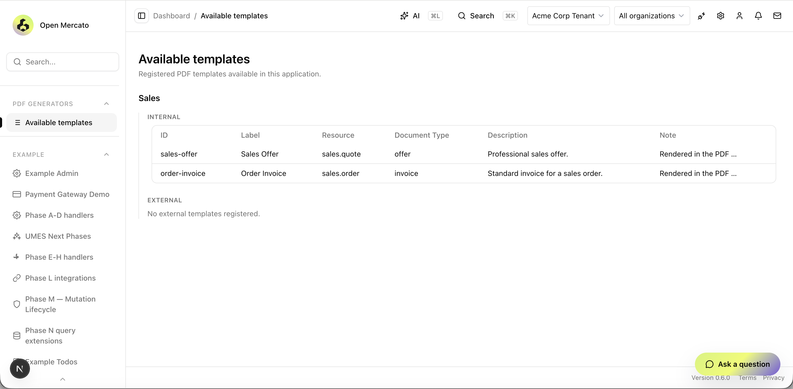
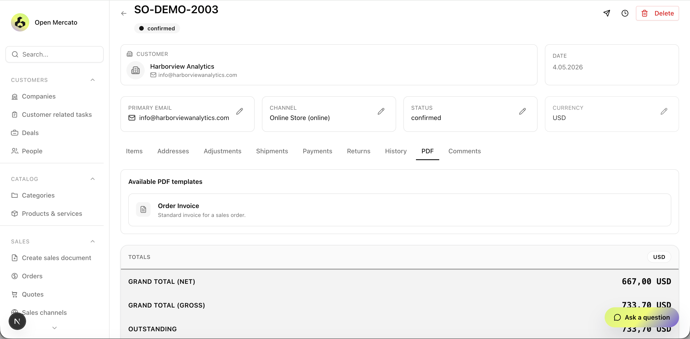
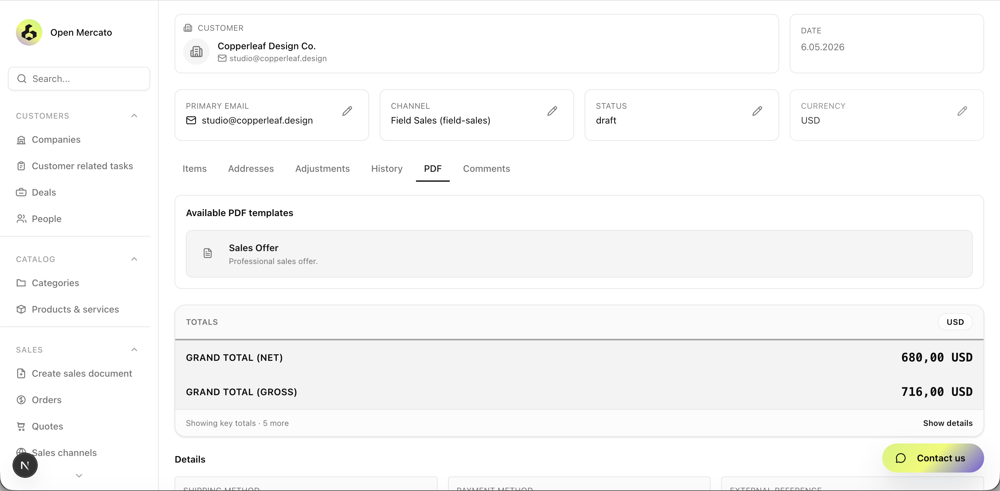
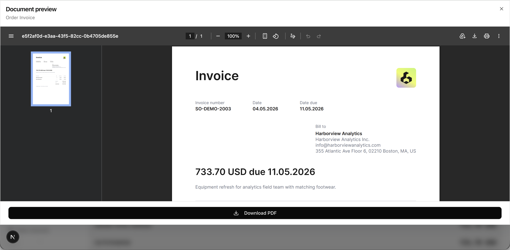

# @open-mercato/pdf-generators


A framework for generating and previewing PDF documents from any Open Mercato module. It provides the rendering infrastructure, a global template registry, a preview/download UI, and an extension API — any module can register its own templates without touching this package.

---

## Requirements

| Dependency | Version |
|------------|---------|
| Open Mercato | `^0.6.2` |
| `react` | `^19.0.0` |

---

## Screenshots

**Template registry — admin page**



**PDF tab on an Order detail page**



**PDF tab on a Quote detail page**



**Document preview dialog**



---

## Quick start

```bash
yarn mercato module add @open-mercato/pdf-generators
```

After installation, navigate to any sales order or quote detail page — a **PDF** tab appears automatically. Clicking a template card opens a full-screen preview; clicking **Download PDF** streams the file.

To register your own templates from another module, create a `pdf-generators.ts` convention file at the root of your module. See [Usage & Integration](docs/usage.md) for the full walkthrough.

> **Shortcut**: use the `scaffold-pdf-templates` Claude Code skill to generate all required files automatically.

---

## Documentation

- [Installation](docs/installation.md)
- [Usage & Integration](docs/usage.md)
- [API Reference](docs/api.md)
- [Contributing](docs/contributing.md)

---

## License

MIT
